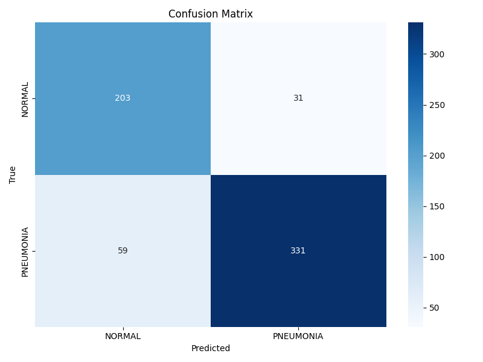

# Pneumonia Detection from Chest X-Rays

This project implements a Convolutional Neural Network (CNN) to classify chest X-ray images as either normal or showing pneumonia. The model serves as a computer-aided diagnosis tool to assist healthcare professionals in pneumonia screening.

## Project Overview

Pneumonia is a life-threatening inflammatory condition of the lung that can be detected through chest X-rays. Automating part of this detection process can help reduce workload for radiologists and potentially improve early diagnosis rates.

## Dataset

The project uses [Kaggle's Chest X-Ray Images (Pneumonia) dataset](https://www.kaggle.com/paultimothymooney/chest-xray-pneumonia).

### Dataset structure:

```bash
data/chest_xray/
├── train/
│   ├── NORMAL/
│   └── PNEUMONIA/
├── val/
│   ├── NORMAL/
│   └── PNEUMONIA/
└── test/
    ├── NORMAL/
    └── PNEUMONIA/
```

## Model Architecture

The model uses a simple CNN architecture:
- 2 convolutional layers with batch normalization and ReLU activation
- Max pooling layers for downsampling
- Fully connected layers for classification
- Input size: 224×224×3 RGB images
- Output: Binary classification (Normal vs Pneumonia)

## Techniques Implemented

- **Data Augmentation**: Random horizontal flips and rotations to improve model robustness
- **Class Imbalance Handling**: Custom weighting scheme for the underrepresented normal class
- **Early Stopping**: Prevents overfitting by monitoring validation loss
- **Transfer Learning**: (If implemented)
- **Visualization**: Training curves and confusion matrices for model analysis

## Results

### Performance Metrics

| Class      | Precision | Recall | F1-Score | Support |
|------------|-----------|--------|----------|---------|
| NORMAL     | 0.77      | 0.87   | 0.82     | 234     |
| PNEUMONIA  | 0.91      | 0.85   | 0.88     | 390     |
| Accuracy   |           |        | 0.86     | 624     |
| Macro Avg  | 0.84      | 0.86   | 0.85     | 624     |
| Weighted Avg| 0.86     | 0.86   | 0.86     | 624     |

### Confusion Matrix


## Challenges and Solutions

### Class Imbalance

The model was being too cautious by classifying too many normal cases as pneumonia. We tackled this by :
- Applying class weights in the loss function (larger multiplier for normal class)
- Exploring data augmentation

### Medical Context Optimization

In a medical context, false negatives (missing pneumonia cases) are more dangerous than false positives. We balanced this requirement with model accuracy by:
- Tuning the weighting scheme to prioritize pneumonia recall
- Ensuring the model doesn't become overly cautious by classifying every instance as pneumonia